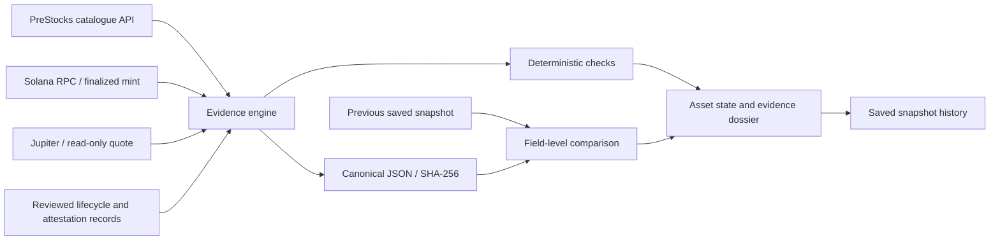

<div align="center">

# PARITY

### Know what’s verified.

[](#technology)
[](#what-parity-is)
[](#deterministic-checks)
[](#snapshot-hashing)

**The integrity and lifecycle monitor for PreStocks.**

Parity snapshots onchain token state, issuer evidence, market observations and lifecycle deadlines, then shows holders what is independently verified, attested, observed or not independently knowable.

[Live app](https://parity-nu-lovat.vercel.app) · [Explore the evidence](#explore-the-evidence) · [How it works](#how-it-works) · [Verify it yourself](#verify-it-yourself) · [Run locally](#run-locally)

**Solana Stocklana · Main Track · PreStocks Bounty**

Next.js · TypeScript · Solana RPC · PreStocks · Jupiter · Vercel Blob

</div>

> **Parity is not Proof of Reserves.** A Solana mint does not independently establish underlying SPV holdings. Issuer terms and third-party attestations retain their sources and scope. Unavailable information stays `NO DATA`.

## Explore the evidence

Open any page without connecting a wallet. The application reads sources and records observations; it does not sign or execute transactions.

| Open | What to inspect | What it establishes |
| --- | --- | --- |
| [Asset register](https://parity-nu-lovat.vercel.app) | Four assets, nine checks each, lifecycle states and scan age | Which recorded conditions deserve attention and which snapshots changed |
| [XAI](https://parity-nu-lovat.vercel.app/c/XAI) | Closed conversion window alongside the observable mint | An onchain token can remain observable after an issuer-defined deadline |
| [SPACEX](https://parity-nu-lovat.vercel.app/c/SPACEX) | Issuer-named conversion target and exact deadline countdown | A required holder action, attributed to the issuer’s disclosure |
| [OPENAI](https://parity-nu-lovat.vercel.app/c/OPENAI) | Raw vs scaled supply, authorities, issuer mark and market premium | The difference between independently observed mint state and sourced economic information |
| [ANTHROPIC](https://parity-nu-lovat.vercel.app/c/ANTHROPIC#issuer) | The published BlockOffice report and its date | What the identified third-party attestation covers, with its limitations |
| [Snapshot history](https://parity-nu-lovat.vercel.app/c/OPENAI#history) | Current/previous hashes and expandable field-level differences | What changed between actual observations |

Lifecycle terms are manually reviewed against first-party disclosures, with review dates and source links in each dossier. For current prices, supplies, routes and check states, open the live app and check the observation timestamp.

## Contents

- [What Parity is](#what-parity-is)
- [Why it exists](#why-it-exists)
- [How it works](#how-it-works)
- [Evidence model](#evidence-model)
- [Deterministic checks](#deterministic-checks)
- [Snapshot hashing](#snapshot-hashing)
- [Verify it yourself](#verify-it-yourself)
- [What is implemented](#what-is-implemented)
- [Server routes](#server-routes)
- [Run locally](#run-locally)
- [Engineering decisions](#engineering-decisions)
- [Technology](#technology)
- [Repository map](#repository-map)
- [Honesty / limitations](#honesty--limitations)
- [60-second demo](#60-second-demo)
- [Acknowledgments](#acknowledgments)

## What Parity is

Parity is the integrity and lifecycle monitor for PreStocks. It records live Solana mint state, sourced issuer disclosures, dated third-party evidence, market observations and holder deadlines. Every observation retains its evidence classification and prior-state comparison. The MVP covers only OPENAI, ANTHROPIC, SPACEX and historical XAI.

## Why it exists

The private company, its holding structure, the PreStock product and the Solana token expose different kinds of information. Holders need to know which layer supports each claim.

| Layer | What belongs here | Parity’s boundary |
| --- | --- | --- |
| Private company | Shares, capitalization and corporate events | A token account does not expose the complete private-company record |
| SPV / holding entity | The arrangements behind the product’s economic exposure | Public issuer explanations and dated third-party reports have a defined scope |
| PreStock product | Reference marks, conversion terms, deadlines and consequences | Preserve the issuer’s wording, source and review date |
| Solana token | Mint, supply, authorities, extensions and metadata | Independently inspect the account through Solana RPC |
| Holder | Possession of tokens and any action required by issuer terms | Surface the evidence and deadlines without investment recommendations |

PreStocks describes economic exposure through holding entities. Token possession alone does not confer direct private-company shareholder rights. The [issuer’s explanation](https://prestocks.com/faq?tab=legal) and available reports are evidence to inspect, not facts derived from token supply.

**XAI illustrates the problem:** the issuer’s conversion deadline can pass while its Solana mint remains observable. Parity places those two facts beside each other without treating either as proof of the other.

## How it works

Each scan reads the active issuer catalogue, inspects the relevant mint and requests a nominal $500 USDC quote. The engine combines these observations with manually reviewed disclosures, evaluates explicit rules and compares the resulting state with the previous saved snapshot.



The graph describes data processing, not a transaction flow. No model makes decisions. The packet animation in the interface illustrates a scan and can replay a recorded result; it does not invent blockchain activity.

Scans run on page/API access, with a **60-second refresh while the page is visible** and a **30-second minimum interval per asset**. Lifecycle records are reviewed manually; the app does not continuously crawl disclosures or send holder alerts.

## Evidence model

| Classification | Examples | Source and limit |
| --- | --- | --- |
| **ONCHAIN VERIFIED** | Mint address, owner program, authorities, raw/base/scaled supply, extensions and metadata | Finalized Solana RPC observations; these do not establish SPV holdings |
| **ISSUER ATTESTED / THIRD-PARTY ATTESTED** | Reference marks, lifecycle terms and identified BlockOffice reports | Link each claim to its issuer or report, including review/report dates and scope |
| **MARKET OBSERVED** | Reported token price, implied valuation, premium and a Jupiter quote | Attribute price data to the PreStocks API and routes to Jupiter; neither is a recommendation |
| **NOT INDEPENDENTLY OBSERVABLE** | Full private cap tables, confidential holding-entity identities and current custody beyond available reports | Name the missing evidence without dismissing the attestations that do exist |

A revoked authority is a known `null`, distinct from unavailable RPC data. An API retrieval timestamp is distinct from the time an issuer last updated its mark. A dated attestation is distinct from a live custody feed.

## Deterministic checks

Nine checks per asset:

1. **Mint match:** live catalogue contract address against the validated SPL mint; onchain metadata mint, where supplied, must agree. `MATCH`, `MISMATCH` or `NO DATA`. XAI's historical association never manufactures a current catalogue match.
2. **Supply:** raw string, integer decimals, exact decimal base UI supply. Effective scaled UI multiplier and display supply are separate. No floating-point arithmetic is used for raw-supply conversion. Token-2022 large integer fields are parsed losslessly.
3. **Mint authority:** `FIRST_SEEN`, `UNCHANGED`, `CHANGED` or `NO DATA`; changes trigger attention.
4. **Freeze authority:** present → `ATTENTION`; revoked → `VERIFIED`; unavailable → `NO DATA`. Presence is not an automatic failure.
5. **Configuration:** hash owner, initialized state, decimals, authorities, extensions and onchain metadata. Accumulating withheld-fee balances are excluded from the configuration fingerprint but retained in the full snapshot. Configuration changes trigger attention.
6. **Mark:** positive reference mark required; missing/nonpositive → `ATTENTION`. API retrieval timestamp and source mark-update timestamp are separate; an absent source timestamp is `NO DATA`.
7. **Lifecycle:** `NONE_ON_FILE`, `ACTION`, `WINDOW_CLOSED`, derived from manually verified first-party terms and the UTC deadline. Exact fractional days are returned by the API; the UI shows complete days plus hours/minutes/seconds.
8. **Premium:** `(tokenPrice - markPrice) / markPrice`. Absolute premium strictly greater than 0.15 triggers attention. Equality at ±15% does not. Missing/nonpositive mark cannot produce a premium. Displayed as percent and basis points.
9. **Jupiter:** $500 nominal USDC, 500000000 raw units, ExactIn, 50 bps slippage. A valid route with impact strictly above 0.03 (3%) triggers attention. A recognized no-route response triggers attention. Timeouts, rate limits and malformed quotes produce `NO DATA`, not `NO`. Raw `priceImpactPct` is retained and multiplied by 100 for percentage display. No swap or wallet transaction exists in the app.

State precedence: overdue required action → **CRITICAL**; future required action → **ACTION**; canonical change → **CHANGED**; any triggered or unavailable check → **ATTENTION**; otherwise **CLEAR**. Additional check attention remains visible even when the headline state is CHANGED. Approaching deadlines alone never create CRITICAL. The check count is checks without triggered conditions divided by total checks, not a risk score or investment judgment.

## Snapshot hashing

Object keys are sorted recursively; array order is retained except mint extensions, which are sorted by extension name. SHA-256 hashes UTF-8 canonical JSON. Included: actual issuer values, mint state, authorities, supply, extensions, metadata, lifecycle terms/state, dated attestation evidence, market quantities, routes and source links. Semantic dates such as a deadline, report date and multiplier activation are retained.

Excluded: observation timestamps, RPC/quote context slots, route update slots, request durations, the derived countdown, computed check statuses and history pointers. These exclusions prevent clock ticks from manufacturing changes. Real quotes, supply activity and market prices can legitimately change on every scan. Field-level diffs preserve previous/current values. Availability changes are recorded; a failed scan never silently substitutes archived observations.

Each saved scan has current/previous hashes, a first-seen timestamp and field-level differences. The first observation has no previous hash and is not labeled CHANGED. Up to 100 complete snapshots per asset are retained. History survives deployments in a private Vercel Blob store. ETag conditional writes prevent lost updates between instances; a competing committed snapshot is returned on collision. Local writes are atomic and same-process scans are coalesced. Local JSON is intended for a single development process.

## Verify it yourself

### Inspect the sources and logic

| Evidence | Where to look |
| --- | --- |
| Current observations and source links | [Live asset register](https://parity-nu-lovat.vercel.app) and each asset’s dossier |
| Catalogue, mint and quote collection | [lib/sources.ts](lib/sources.ts) |
| Reviewed lifecycle terms and report records | [data/lifecycle.ts](data/lifecycle.ts) |
| Exact check and state logic | [lib/checks.ts](lib/checks.ts) |
| Canonicalization and field-level differences | [lib/canonical.ts](lib/canonical.ts), [state-bearing fields](lib/engine.ts) |

### Request a fresh observation

```sh
curl --fail --silent --show-error https://parity-nu-lovat.vercel.app/api/scan
curl --fail --silent --show-error https://parity-nu-lovat.vercel.app/api/scan/OPENAI
```

Inspect `scannedAt`, `observations`, `errors`, `canonical`, `currentHash`, `previousHash` and `changedFields`. A call within the minimum interval returns the saved observation with its actual age. Requests read upstream sources and may append a snapshot to Parity’s history; they never submit a Solana transaction.

After installing dependencies, run the same engine locally:

```sh
npm run scan
npm test
npm run typecheck
npm run build
```

The [12 engine tests](tests/engine.test.ts) cover canonicalization, lossless token parsing, multiplier activation, account validation, exact deadlines, premium/impact boundaries, route failures, authority changes and historical-mint provenance. Test fixtures use captured responses with controlled changes for boundary cases. Passing tests do not establish live source availability or verify offchain holdings.

## What is implemented

| Capability | Implementation |
| --- | --- |
| Four-asset register and detail pages | OPENAI, ANTHROPIC, SPACEX and historical XAI |
| Onchain scans | Mainnet RPC, finalized commitment, Token and Token-2022 parsing |
| Issuer and backing evidence | Sourced catalogue fields, manually curated terms and identified attestation reports |
| Market observations | Reported prices, deterministic premium and real $500 Jupiter quotes |
| Lifecycle handling | Exact deadline transitions and dynamic countdowns |
| Change history | Canonical SHA-256, previous/current comparison and field-level diffs |
| Persistence | Local JSON or private Vercel Blob; up to 100 complete scans per asset |
| Flow animation | Scan illustration, recorded-result replay, pause and reduced-motion support |

Wallet connections, swaps, portfolio management, investment recommendations, generic news and LLM scoring are outside this implementation.

## Server routes

- `GET /api/scan`: catalogue summary, each asset's checks, state, lifecycle, hash pair, change flag, scan age, and an aggregate state hash.
- `GET /api/scan/[symbol]`: complete observation, canonical JSON, field-level differences, source URLs and saved history. Unknown symbols return 404.

The UI polls once per minute while visible and offers SCAN NOW. Calls within 30 seconds reuse the saved observation with its actual timestamp and age. Scan age never implies source mark freshness. Source requests time out after 15 seconds. History-storage failure returns 503 rather than silently starting a new comparison chain. If production storage is not configured, the response explicitly says history is not saved.

## Run locally

Requires Node.js 20.9+ (Vercel project uses Node.js 24), npm and outbound HTTPS.

```sh
npm ci
cp .env.example .env.local
npm run dev
```

Set `RPC_URL` to a mainnet Solana RPC endpoint if desired; blank uses the public mainnet endpoint. Credentials are server-only and are never returned by the API or used by browser code. `npm run scan` runs the engine directly (load environment variables through your shell if using a private endpoint). Local history uses ignored `.parity/*.json` files with atomic replacement. `BLOB_READ_WRITE_TOKEN` enables private Vercel Blob storage. Never commit `.env.local`.

| Variable | Purpose |
| --- | --- |
| `RPC_URL` | Optional mainnet endpoint; empty uses the public Solana RPC |
| `BLOB_READ_WRITE_TOKEN` | Optional private Blob credentials for durable history |
| `CRON_SECRET` | Reserved configuration placeholder; no scheduled-scan route is implemented |

With no Blob token, local scans write to `.parity/`. On Vercel, an unconfigured store is reported explicitly as unavailable rather than presented as durable history. The deployed app uses a private Blob store.

## Engineering decisions

- **Preserve provenance.** Onchain observations, issuer statements, third-party reports and market data are never collapsed into a single claim of backing.
- **Keep time honest.** Source retrieval clocks are shown separately from semantic dates. Countdown ticks and RPC slots do not manufacture state changes.
- **Retain numerical meaning.** Raw supply stays a decimal string. Base supply and effective scaled UI supply remain separate, with large Token-2022 integers parsed losslessly.
- **Distinguish missing evidence from a negative result.** A quote timeout is `NO DATA`; a recognized no-route response is `NO`. A missing public report does not prove that no report exists.
- **Protect comparison continuity.** Storage failures do not silently create a fresh history. Conditional Blob writes prevent one instance from overwriting another’s committed chain.
- **Make the decision path inspectable.** Explicit thresholds and source-linked checks replace an opaque score. Real market changes can still produce a new hash on every scan.

## Technology

| Layer | Technology |
| --- | --- |
| Application | Next.js App Router, React, TypeScript |
| Styling and motion | Tailwind CSS, CSS and SVG animations |
| Onchain observations | Solana JSON-RPC with `jsonParsed` mint accounts |
| Issuer data | PreStocks catalogue API and manually reviewed first-party disclosures |
| Market routing observation | Jupiter Lite quote API |
| Numeric handling | `decimal.js` and `json-bigint` |
| Snapshots | Node.js SHA-256; local JSON or private Vercel Blob |
| Deployment | [Vercel production app](https://parity-nu-lovat.vercel.app) |
| Validation | Node.js test runner through `tsx`, TypeScript and Next.js production build |

Exact dependency versions are recorded in [package-lock.json](package-lock.json).

## Repository map

| Path | Responsibility |
| --- | --- |
| [app](app) | Register, detail pages and server API routes |
| [components](components) | Evidence tables, lifecycle blocks, history and scan-flow animation |
| [lib/sources.ts](lib/sources.ts) | Source requests, catalogue normalization, mint and quote parsing |
| [lib/checks.ts](lib/checks.ts) | Nine deterministic checks and state precedence |
| [lib/engine.ts](lib/engine.ts) | Evidence collection and state-bearing snapshot fields |
| [lib/canonical.ts](lib/canonical.ts) | Sorted serialization, SHA-256 and recursive differences |
| [lib/service.ts](lib/service.ts) | Scan coalescing, minimum interval and API response assembly |
| [lib/store.ts](lib/store.ts) | Atomic local writes and conditional private Blob persistence |
| [data/lifecycle.ts](data/lifecycle.ts) | Reviewed lifecycle disclosures and attestation records |
| [scripts](scripts) | Source collection and command-line scanner |
| [tests/engine.test.ts](tests/engine.test.ts) | Evidence-engine regression and boundary tests |
| [.env.example](.env.example) | Server-only configuration template |

## Honesty / limitations

- Parity is not Proof of Reserves.
- Onchain token state does not independently prove underlying SPV holdings.
- Issuer claims are labeled as issuer evidence; published reports are identified as third-party attestations, with their date and limited scope.
- Market observations are not investment recommendations.
- Jupiter observations cover the measured permissionless Solana route only.
- Missing Jupiter liquidity does not establish absence of liquidity elsewhere.
- Public RPC services and Jupiter Lite can rate-limit or become unavailable. Missing values remain `NO DATA`.
- Lifecycle evidence is manually curated in `data/lifecycle.ts`, reviewed on the date displayed, not automatically inferred from headlines. Subsequent disclosure changes require a human review and code update.
- The app observes on page/API access; it does not provide a guaranteed real-time feed, push alerts or continuous issuer-document review.
- The publicly linked reports do not expose a complete cap table, underlying confidential documents or a live holding-entity custody feed.
- Historical XAI catalogue prices are not manufactured. Its current issuer API values remain `NO DATA` when the asset is absent, even when its mint and a market route remain observable.

## 60-second demo

1. **0–10s:** Asset register — private exposure, issuer claim and Solana token are separate evidence layers.
2. **10–25s:** XAI — show issuer conversion terms, closed deadline, issuer consequence and observable mint together.
3. **25–40s:** SPACEX — show the verified target wording and live countdown.
4. **40–52s:** OPENAI — inspect mint, supply, authorities, mark, market price, premium and backing classification.
5. **52–60s:** Open a real changed history row. Parity observes what it can, labels sourced claims, and records what changed.

## Acknowledgments

- [PreStocks](https://prestocks.com) provides the product catalogue and issuer disclosures; report links identify their third-party provider.
- [OFT Sentinel](https://oft-sentinel.netlify.app/) inspired the source-to-checker packet motion. Parity’s animation represents evidence processing, not token transfers.
- [Morrow](https://github.com/Enoch208/morrow/) inspired this README’s guided tour, evidence links, architecture explanation and explicit trust boundaries.

**Know what’s verified. See what changed. Understand what still depends on trust.**
